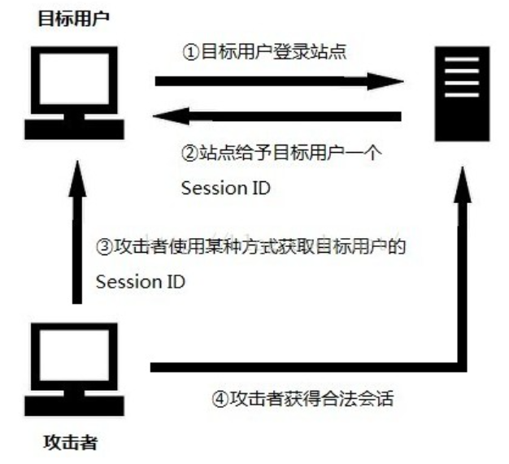

# 《实验一：第04章 会话技术》
学院：省级示范性软件学院

题目：《实验一：第04章 会话技术》

姓名：赵文胤

学号：2200770084

班级：软工2202

日期：2024-09-29

## 会话安全性

### 会话劫持和防御

* #### 定义：

会话劫持是指攻击者通过窃取用户的会话标识符（如Session ID）来获取对用户账户的访问权限。

* #### 攻击步骤

1、 目标用户需要先登录站点；

2、 登录成功后，该用户会得到站点提供的一个会话标识SessionID；

3、 攻击者通过某种攻击手段捕获Session ID；

4、 攻击者通过捕获到的Session ID访问站点即可获得目标用户合法会话。



攻击者获取SessionID的方式有多种：

       1、 暴力破解：尝试各种Session ID，直到破解为止；

       2、 预测：如果Session ID使用非随机的方式产生，那么就有可能计算出来；

       3、 窃取：使用网络嗅探，XSS攻击等方法获得。

对于PHP来说，其内部Session的实现机制虽然不是很安全，但是关于生成Session ID的环节还是比较安全的，这个随机的Session ID往往是极其复杂的并且难于被预测出来，所以，对于第一、第二种攻击方式基本上是不太可能成功的。

对于第三种方式大多使用网络数据通讯层进行攻击获取，可以使用SSL进行防御。

在应用层上也可以做出相应的防御措施：

目前有三种广泛使用的在Web环境中维护会话（传递Session ID）的方法：URL参数，隐藏域和Cookie。其中每一种都各有利弊，Cookie已经被证明是三种方法中最方便最安全的。从安全的观点，如果不是全部也是绝大多数针对基于Cookie的会话管理机制的攻击对于URL或是隐藏域机制同样适用，但是反过来却不一定，这就让Cookie成为从安全考虑的最佳选择。


* #### 防御措施：

使用HTTPS：确保数据在传输过程中被加密，防止中间人攻击。

HttpOnly和Secure Cookie：设置Cookie的HttpOnly标志可以防止JavaScript访问，Secure标志确保Cookie只在HTTPS连接中发送。

会话超时：定期使会话过期，减少长期有效的会话标识符被利用的风险。

IP绑定：将会话标识符与用户的IP地址绑定，检测异常活动。

防御代码：
```
Cookie cookie = new Cookie("sessionId", sessionId);
cookie.setHttpOnly(true);
cookie.setSecure(true);
response.addCookie(cookie);


```

### 跨站脚本攻击（XSS）和防御

* #### 定义：

XSS攻击是指攻击者在网页中注入恶意脚本，用户在访问时执行这些脚本。

* #### 防御措施：

输入验证：对用户输入进行严格的验证，过滤掉恶意代码。

输出编码：在输出数据到浏览器之前，对数据进行HTML编码，防止脚本执行。

Content Security Policy (CSP)：使用CSP限制网页可以加载的资源，降低XSS攻击的风险。
```angular2html
<meta http-equiv="Content-Security-Policy" content="default-src 'self';">
```
同源策略：确保网站只加载和执行来自相同源的资源。

### 跨站请求伪造（CSRF）和防御

* #### 定义：
CSRF攻击是指攻击者利用已登录用户的身份，诱导其向受信任网站发起未授权的请求。

* #### 防御措施：

CSRF令牌：每个请求中加入唯一的CSRF令牌，验证请求的合法性。

Referer验证：检查请求的Referer头，确保请求来源于合法页面。

SameSite Cookie属性：设置Cookie的SameSite属性，可以防止第三方网站发送请求。

Java示例：生成CSRF令牌
```
String csrfToken = UUID.randomUUID().toString();
request.getSession().setAttribute("csrfToken", csrfToken);

```


## 分布式会话管理

### 分布式环境下的会话同步问题

* #### 挑战：
在分布式架构中，用户的请求可能被不同的服务器处理，如何保持会话状态的一致性是一个重要问题。

* #### 问题：
如果一个用户的会话数据存储在一个服务器上，而用户的请求被转发到另一个服务器，可能会导致会话丢失或不一致。

### Session集群解决方案

* #### 负载均衡：
通过使用负载均衡器，将用户的请求均匀分配到多个服务器，并确保会话信息的共享。

* #### 会话复制：
在多个服务器间复制会话数据，确保每个节点都可以访问最新的会话信息。

* #### Sticky Sessions：
将用户的请求绑定到特定的服务器，直到会话结束，减少会话数据同步的问题。

### 使用Redis等缓存技术实现分布式会话

Redis：作为高性能的键值存储，可以存储会话数据，实现快速的读取和写入操作。
```
Jedis jedis = new Jedis("localhost");
jedis.set("sessionId", "sessionData");
```
* #### 实现：

在用户登录时，将会话数据存储到Redis中。

通过Session ID来检索和管理会话信息。

使用Redis的过期机制来处理会话超时。

## 会话状态的序列化和反序列化

### 会话状态的序列化和反序列化

* #### 定义：
序列化是将对象转化为字节流，以便存储或传输；反序列化是将字节流恢复为对象。

* #### 应用：

在分布式系统中，序列化可以将会话状态存储到数据库或缓存中，便于恢复。

Java对象序列化
```
ObjectOutputStream out = new ObjectOutputStream(new FileOutputStream("session.dat"));
out.writeObject(sessionObject);
out.close();
```

自定义序列化策略
```java
public class MySession implements Serializable {
    private String username;
    private transient String password; 
    
    
    private void writeObject(ObjectOutputStream oos) throws IOException {
        oos.defaultWriteObject();
    }
}

```

### 为什么需要序列化会话状态

* #### 持久化
需要将会话状态持久化到存储中，以便在服务器重启或会话转移时恢复。

* #### 跨进程通信
在分布式架构中，不同的进程或服务器可能需要共享会话状态，序列化允许跨越网络传输数据。

* #### 支持扩展
通过序列化，可以方便地在不同语言或平台之间交换会话数据。


参考文献

https://www.cnblogs.com/phpstudy2015-6/p/6776919.html#_label4
https://github.com/lilidemeimei/note/blob/master/books/%E3%80%8AXSS%E8%B7%A8%E7%AB%99%E8%84%9A%E6%9C%AC%E6%94%BB%E5%87%BB%E5%89%96%E6%9E%90%E4%B8%8E%E9%98%B2%E5%BE%A1%E3%80%8B.pdf
https://blog.csdn.net/cui_yonghua/article/details/126579098
